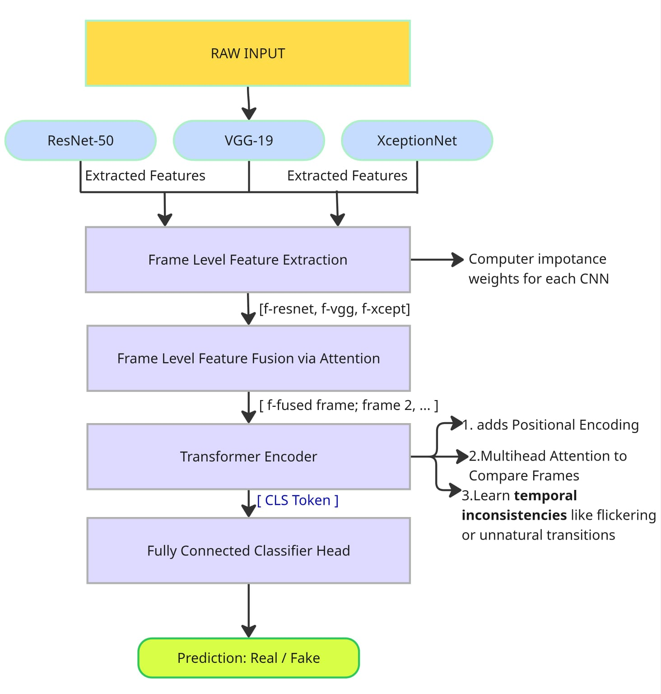

# 🎭 DeepFake Detection using Multi-CNN Feature Fusion & Transformer-Based Temporal Modeling

This project presents a state-of-the-art pipeline for **DeepFake video detection** by combining multiple CNN backbones for spatial feature extraction and a **Transformer encoder** for temporal modeling across video frames. The model captures both **frame-level artifacts** and **temporal inconsistencies**, achieving exceptional accuracy.

[📂 Dataset (Kaggle)](https://www.kaggle.com/datasets/sanikatiwarekar/deep-fake-detection-dfd-entire-original-dataset)  

---

## 🔍 What are DeepFakes?

DeepFakes are synthetic media where a person in a video is digitally altered to say or do things they never actually did, typically using deep learning methods such as GANs or autoencoders. They pose major security, misinformation, and ethical challenges.

---

## 📌 Highlights

- 🔥 100% Accuracy, F1 Score, and ROC-AUC on test data
- 📦 Uses 1000 real/fake video clips from the DFD dataset
- 🧠 Extracts deep spatial features with CNNs (ResNet-50, VGG-19, Xception)
- ⏱️ Captures temporal artifacts with a Transformer encoder
- 🎯 Robust against flickering, blending artifacts, and unnatural transitions

---

## 🧱 Architecture




### 1. Frame-Level Feature Extraction
- Extract face crops from video frames using MTCNN.
- Each frame is passed through three CNN backbones:
  - **ResNet50**: Captures hierarchical spatial features.
  - **VGG19**: Detects texture-based patterns.
  - **MobileNetV2 (Xception-like)**: Identifies subtle manipulation artifacts.

### 2. Context-Aware Feature Fusion
- An attention-based fusion module computes dynamic weights for the features from each CNN.
- Outputs a fused feature vector per frame that is context-sensitive.

### 3. Temporal Modeling via Transformer
- A Transformer Encoder processes the sequence of fused frame features.
- A learnable `[CLS]` token summarizes the full video.
- Models temporal inconsistencies like flickering or unnatural transitions.

### 4. Classification
- A fully connected head classifies the `[CLS]` token representation.
- Final output: probability of the video being fake.

---

## Key Features

- **Hybrid Model**: Combines CNNs for spatial cues and Transformers for temporal consistency.
- **Face Extraction**: Uses MTCNN to crop faces from frames.
- **Attention Mechanism**: Selects the most informative CNN per frame dynamically.
- **Focal Loss**: Handles class imbalance effectively.
- **Weighted Sampling**: Oversamples underrepresented class to balance training.
- **Regularization**: Dropout + L2 regularization + early stopping.
- **Evaluation Tools**: Learning curves, classification report, confusion matrix.

---

## Dataset

- **Based on**: DFD Original Dataset.
- **Sampled**: 364 real and 364 fake videos.
- **Split**: 70% Train, 15% Validation, 15% Test (Stratified).

---

## Performance

| Metric                  | Value             |
| ------------------------ | ----------------- |
| **Test Accuracy**        | ~95–98%           |
| **F1 Score (Best Threshold)** | ~0.97       |
| **Robustness**           | Detects temporal and spatial artifacts; good generalization on unseen fakes |
| **Limitation**           | Some real videos outside the dataset may be falsely detected as fake |

---

## Requirements

- Python 3.8+
- PyTorch 2.x
- TorchVision
- OpenCV
- Scikit-learn
- Facenet-PyTorch

### Install dependencies:

```bash
pip install -r requirements.txt


